# MessageBroker

고성능 메시지 수신, 저장, 조회 구조를 직접 구현한 C++ 기반 Message Broker 학습 프로젝트입니다.

단순히 `recv -> queue -> pop` 형태의 큐를 만드는 것이 아니라, 메시지 브로커를 Storage Engine 관점에서 설계하고 병목을 측정하면서 개선하는 것을 목표로 했습니다.

## Key Features

- UDP 기반 고속 메시지 수신
- Producer / Consumer 구조
- Receive Thread / Worker Thread 분리
- Ready Queue / Process Queue 기반 Buffer Pool
- Batch Receive 및 Batch Insert
- Topic 기반 Storage 분리
- Append-Only Segment Storage
- Offset 기반 메시지 조회
- Binary Search 기반 Block 탐색
- Topic Lock 분산
- Zero-Copy Read
- TCP Batch Query
- TTL 및 참조 횟수 기반 GC
- 성능 측정 기반 개선 기록

## Architecture

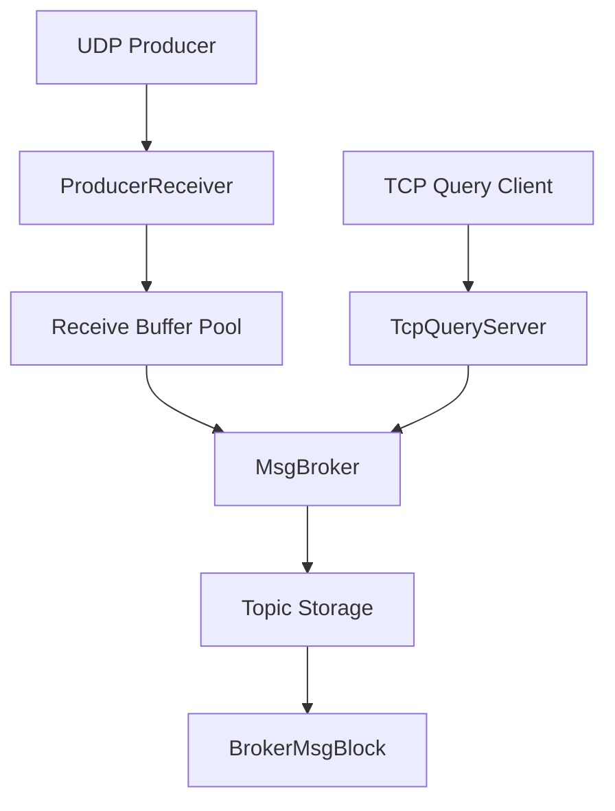

## Overall Flow

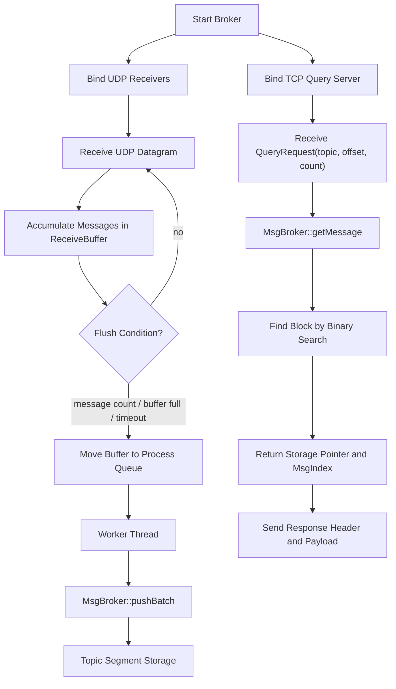

## Write Path

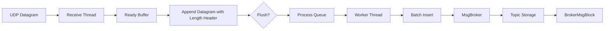

## Read Path

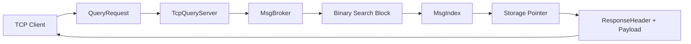

## Storage Structure

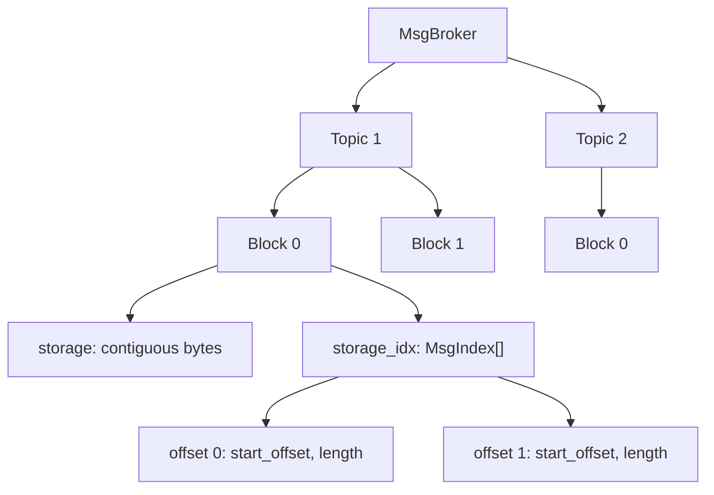

## Component Details

### BrokerMsgBlock

`BrokerMsgBlock`은 실제 메시지 데이터를 저장하는 Segment 단위입니다. 하나의 Block은 고정 크기의 내부 Storage Buffer를 가지고 있으며, 메시지는 append-only 방식으로 순차 저장됩니다.

메시지 데이터는 하나의 연속된 `storage` 버퍼에 저장하고, 각 메시지의 위치 정보는 `MsgIndex` 배열에 별도로 관리합니다. 이를 통해 메시지별 동적 할당을 줄이고, 순차 접근과 offset 기반 조회에 유리한 구조를 구성했습니다.

| Feature | Description |
|---|---|
| Append 저장 | 메시지를 기존 데이터 뒤에 순차적으로 저장 |
| MsgIndex 관리 | 메시지별 `start_offset`, `length` 관리 |
| Batch Insert | ReceiveBuffer에 누적된 여러 메시지를 한 번에 파싱하고 저장 |
| Block Full 판단 | 현재 Block에 공간이 부족하면 write 상태를 닫고 다음 Block으로 rollover |
| Zero-Copy Read 지원 | 내부 Storage Pointer와 MsgIndex를 반환해 payload 복사를 줄임 |
| GC 판단 | TTL, write state, 마지막 메시지 참조 횟수를 기준으로 삭제 가능 여부 판단 |

```text
BrokerMsgBlock
├─ storage
│  ├─ [Message 0 bytes]
│  ├─ [Message 1 bytes]
│  └─ [Message 2 bytes]
│
└─ storage_idx
   ├─ { start_offset: 0,    length: 1028 }
   ├─ { start_offset: 1028, length: 1028 }
   └─ { start_offset: 2056, length: 1028 }
```

### MsgBroker

`MsgBroker`는 전체 메시지 저장 구조를 관리하는 Storage Engine입니다. Topic별로 독립된 Block 목록을 관리하며, 메시지 삽입, 조회, Block 생성, GC를 담당합니다.

쓰기 경로에서는 `pushBatch()`를 통해 여러 메시지를 한 번에 저장하고, 읽기 경로에서는 Topic과 Offset을 기준으로 Block을 찾은 뒤 Storage 참조를 반환합니다.

| Feature | Description |
|---|---|
| Topic Storage 관리 | `unordered_map<int, deque<BrokerMsgBlock>>` 형태로 Topic별 저장소 관리 |
| Topic 자동 생성 | 메시지 삽입 시 Topic이 없으면 자동 생성 |
| Segment Rollover | 현재 Block이 가득 차면 새 Block 생성 |
| Batch Insert | `ProducerReceiver`에서 전달한 ReceiveBuffer를 한 번에 처리 |
| Offset 조회 | Topic과 Offset으로 메시지 조회 |
| Binary Search | Offset이 포함된 Block을 빠르게 탐색 |
| Topic Lock 분산 | 64개 shared mutex 기반 lock striping으로 Topic 간 경합 감소 |
| Garbage Collection | TTL 및 삭제 가능 조건에 따라 오래된 Block 정리 |
| Zero-Copy API | `const char*`와 `MsgIndex`를 반환해 복사 비용 감소 |

### ProducerReceiver

`ProducerReceiver`는 UDP 기반 메시지 수신 계층입니다. 수신 스레드와 처리 스레드를 분리하여 네트워크 수신이 Broker 저장 처리에 의해 지연되지 않도록 설계했습니다.

수신된 UDP 메시지는 즉시 Broker에 전달하지 않고 `ReceiveBuffer`에 누적됩니다. Flush 조건을 만족하면 해당 Buffer를 Process Queue로 넘기고, Worker Thread가 이를 `MsgBroker::pushBatch()`로 전달합니다. 처리가 끝난 Buffer는 reset 후 Ready Queue로 반환됩니다.

| Feature | Description |
|---|---|
| UDP Datagram 수신 | `recvfrom()` 기반 메시지 수신 |
| Receive Thread | 네트워크 수신과 Buffer 누적 담당 |
| Worker Thread | Process Queue의 Buffer를 Broker에 Batch Insert |
| Buffer Pool | Ready Queue / Process Queue 기반 Buffer 재사용 |
| 동적 Buffer 확장 | Ready Buffer가 부족하면 최대 32개까지 추가 생성 |
| Flush 조건 | 메시지 1,000개, Buffer 공간 부족, 10ms timeout |
| Socket Option | UDP receive buffer를 128MB로 설정 |

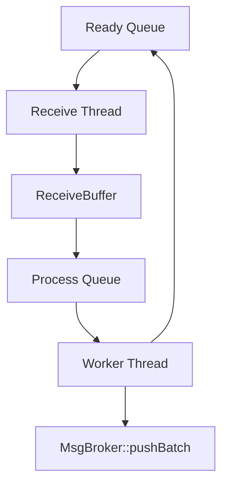

### TcpQueryServer

`TcpQueryServer`는 저장된 메시지를 TCP 기반으로 조회하기 위한 Query Layer입니다. Client는 `topic`, `offset`, `count`를 포함한 `QueryRequest`를 보내고, Server는 해당 Topic의 Offset부터 `count`개 메시지를 조회합니다.

초기 구조는 단건 조회 중심이었지만, 현재는 `count` 필드를 이용한 Batch Query를 지원합니다. 응답은 각 메시지마다 `QueryResponseHeader`를 먼저 보내고, 성공한 경우 payload를 이어서 전송합니다.

| Feature | Description |
|---|---|
| TCP Query Server | Client 연결 수락 및 조회 요청 처리 |
| QueryRequest | `topic`, `offset`, `count` 기반 요청 |
| Batch Query | 단일 요청으로 연속 Offset 조회 |
| Response Header | `resultCode`, `payloadLength` 반환 |
| Zero-Copy Send | Storage Pointer와 MsgIndex를 이용해 payload 직접 송신 |
| recvAll / sendAll | 고정 크기 송수신 안정성 확보 |

```text
QueryRequest
├─ topic
├─ offset
└─ count

QueryResponseHeader
├─ resultCode
└─ payloadLength
```

## Performance Summary

| Category | Result |
|---|---:|
| UDP Receiver Count | 5 |
| Total Message Count | 1,000,000 |
| Message Size | 1KB |
| Stored Message Count | 1,000,000 |
| Lost Message Count | 0 |
| Write Time | 3.50181 sec |
| Write Throughput | 285,567 msg/s |
| Query Success Count | 1,000,000 |
| Query Fail Count | 0 |
| Average Query Throughput | about 31,147 msg/s |

## Broker Engine Write Performance

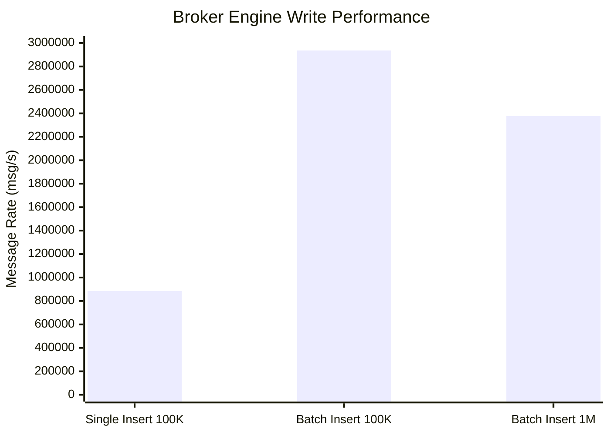

| Test Case | Message Count | Payload Size | Batch Count | Message Rate | Throughput |
|---|---:|---:|---:|---:|---:|
| Single Insert | 100,000 | 1,024 bytes | 1 | 884,940 msg/s | 867 MB/s |
| Batch Insert | 100,000 | 1,000 bytes | 500 | 2,935,690 msg/s | 2,810 MB/s |
| Batch Insert | 1,000,000 | 1,024 bytes | 500 | 2,377,940 msg/s | 2,331 MB/s |

Single Insert 대비 Batch Insert 적용 후 Broker Engine 저장 성능이 크게 증가했습니다. 100,000건 기준 약 884K msg/s에서 약 2.93M msg/s까지 증가했고, 1,000,000건 기준에서도 약 2.37M msg/s 수준의 처리량을 유지했습니다.

## End-to-End Write Performance

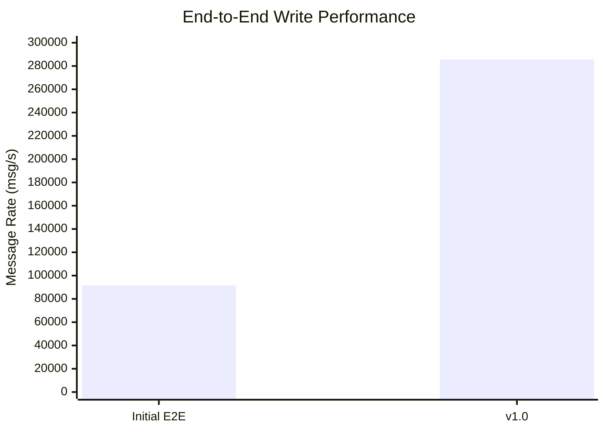

| Version | Receiver Count | Message Count | Stored Count | Lost Count | Write Time | Write Rate |
|---|---:|---:|---:|---:|---:|---:|
| Initial E2E | 1 | 1,000,000 | 999,997 | 3 | 10.923 sec | 91,546 msg/s |
| v1.0 | 5 | 1,000,000 | 1,000,000 | 0 | 3.50181 sec | 285,567 msg/s |

초기 End-to-End 구조에서는 단일 Receiver 기준 약 91K msg/s 수준의 수신/저장 성능을 보였습니다. v1.0에서는 UDP Receiver 5개를 동시에 구동하고 Batch Insert 구조를 적용하여 약 285K msg/s까지 처리량이 증가했습니다. 또한 초기 테스트에서는 UDP 수신 단계에서 3건의 유실이 발생했지만, v1.0 테스트에서는 1,000,000건 전체를 유실 없이 저장했습니다.

## Read Performance Improvement

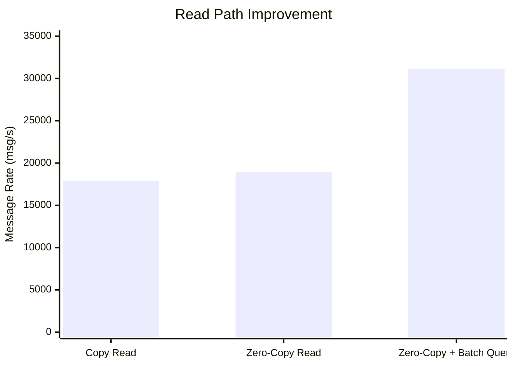

| Step | Description | Message Rate | Improvement |
|---|---|---:|---:|
| Copy Read | `vector.assign()` 기반 payload 복사 | about 17,900 msg/s | Baseline |
| Zero-Copy Read | Storage 참조 기반 payload 직접 송신 | about 18,900 msg/s | about 5-7% |
| Zero-Copy + Batch Query | 단일 요청으로 연속 Offset 조회 | about 31,147 msg/s | about 80% |

기존 Read Path는 메시지를 조회할 때마다 `vector.assign()`을 통해 payload를 복사했습니다. Zero-Copy Read 적용 후 Storage 내부 버퍼를 직접 참조하여 송신하도록 변경했고, 약 5-7%의 성능 향상을 확인했습니다.

이후 Query Header에 `count` 필드를 추가하여 단일 요청으로 다수의 연속 Offset을 조회할 수 있도록 개선했습니다. Batch Query 적용 후 평균 TCP Query 처리량은 약 31K msg/s 수준으로 증가했고, 기존 Copy Read 대비 전체 읽기 성능은 약 80% 향상되었습니다.

## Topic Query Performance

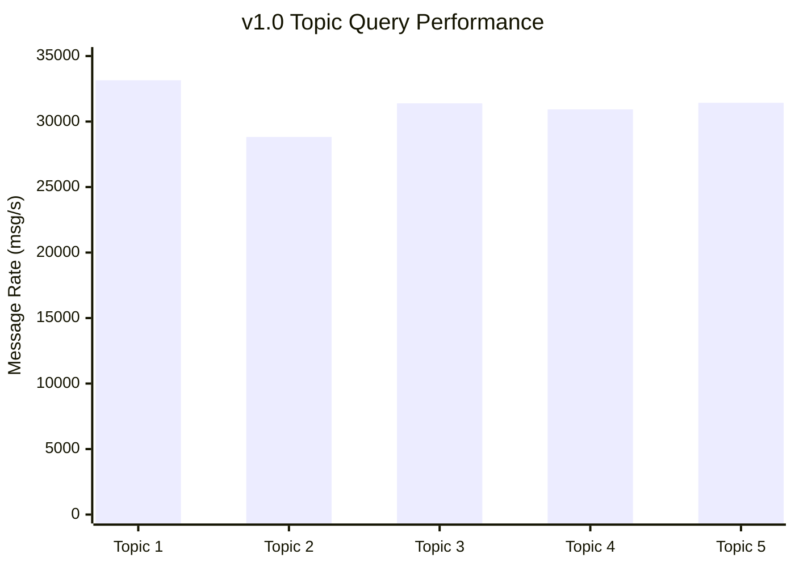

| Topic | Query Count | Success | Fail | Throughput |
|---:|---:|---:|---:|---:|
| 1 | 200,000 | 200,000 | 0 | 33,153 msg/s |
| 2 | 200,000 | 200,000 | 0 | 28,825 msg/s |
| 3 | 200,000 | 200,000 | 0 | 31,393 msg/s |
| 4 | 200,000 | 200,000 | 0 | 30,931 msg/s |
| 5 | 200,000 | 200,000 | 0 | 31,431 msg/s |
| **Total** | **1,000,000** | **1,000,000** | **0** | **about 31,147 msg/s** |

## Performance Timeline

```mermaid
flowchart LR
    q["Single recv / queue style idea"] --> storage["Storage Engine approach"]
    storage --> append["Append-Only Segment"]
    append --> batch["Batch Insert"]
    batch --> doubleBuffer["Receive Buffer Pool"]
    doubleBuffer --> multiRecv["Multi UDP Receiver"]
    multiRecv --> zeroCopy["Zero-Copy Read"]
    zeroCopy --> batchQuery["TCP Batch Query"]
    batchQuery --> topicLock["Topic Lock Striping"]
    topicLock --> v1["v1.0: 1M stored, 0 lost"]
```

## Validation Result

| Item | Status |
|---|---|
| Multi UDP Receiver | Passed |
| Multi Topic Storage | Passed |
| Batch Insert | Passed |
| Batch Query | Passed |
| Zero-Copy Read | Passed |
| Message Loss Test | Passed |
| 1,000,000 Message Integrity Test | Passed |

## Design Lessons

이 프로젝트에서 가장 중요한 지점은 브로커를 단순히 구현한 것이 아니라, 성능 병목을 측정하고 원인을 찾은 뒤 구조를 개선했다는 점입니다.

- `recv()` 경로가 저장 처리에 막히는 문제를 Receive Thread / Worker Thread 분리와 Buffer Pool로 개선
- 메시지 단건 삽입 비용을 Batch Insert로 개선
- payload 복사 비용을 Zero-Copy Read로 개선
- TCP 요청 왕복 비용을 Batch Query로 개선
- Topic 간 경합을 Topic Lock Striping으로 완화

## Future Work

- TCP Batch Response를 하나의 큰 응답 버퍼로 묶는 방식 검토
- Disk Persistence
- Snapshot
- Recovery Mechanism
- Multi Port Receiver 자동 스케일링
- 더 정교한 GC 정책
